## OpenFOAM function objects
---

This repository contains a collection of additional OpenFOAM foundation function objects.

---

### 1. refinementInfo
This function object writes any user-specified `uniformDimensionedScalarField` found in the registry at each `execute()` call.

> [!NOTE]
> - created to write run-time into a file all info available associated with mesh refinement process;
>
> - it needs modified `refiner` (see [modified dynamicFvMesh](https://github.com/ptava/fvMeshTopoChangers.git)) because is designed to access stored values in the registry such as `nTotToRefine`, `nTotRefined`, `lowerLimit`, `upperLimit` etc.

---

### 2. sasRefineIndicator
This function object generates a `volScalarField` that drives adaptive mesh refinement.

> [!NOTE]
> - computations are restricted to `cellZone` defined by the user, allowing to focus refinement on specific regions of the domain;
> - it is tailored for Scale-Adaptive Simulation (SAS) modelling, where mesh refinement should focus on regions of interest defined bu the turbulence length scales;
> - requires length scale `Lvk` and its terms `C1` and `C2` (where $Lvk=max(C1,C2)$): available options to store these fields are in a modified `kOmegaSSTSAS` turbulence model (see [modified kOmegaSSTSAS](https://github.com/ptava/kOmegaSSTSAS.git)).

#### Available user options (refinement criteria):

Refinement indicator based on the **von Kármán length scale** ($L_{vk}$) and is
designed to serve as an adaptive refinement indicator for a Scale Adaptive
(SA) turbulente model.

Where:
- $L_{vk} = \max(c_1, c_2)$
- $c_1$ is the physical turbulence length scale
- $c_2$ is the grid-related high wave number damper (linked to grid size)

The porpose is to adaptively refine mesh in regions where vortices are being
detected by a scale-resolving simulation, refining in vortices-associated
regions and coarsening outside them.

Options are provided to enphasise different regions of the flow/vortices:

##### 1. **focusRegion = "core"**

Focuses refinement targeting the core of turbulent eddies detected by Scale-Adaptive Simulation (SAS) models. It aims to refine the mesh where the "grid filter" ($c_2$) is larger than the "physical length scale" ($c_1$), indicating that the current mesh is too coarse to resolve the turbulent structures present.

Available transfer functions:

###### a) **markCoreConstant**:

Apply constant value to all cells where $d = c2 - c1 > 0$

```math
    f(d) = \text{const}
```


###### b) **markCoreOddScaler**:

Apply an odd, monotonic, sign-preserving function, symmetric around
origin, normalised by its maximum value:

<table align="center">
  <tr>
    <td align="center">
      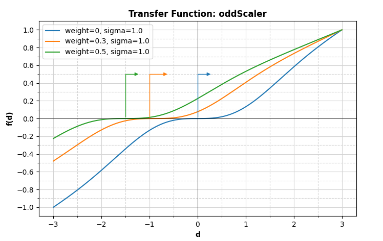
    </td>
    <td align="center">
      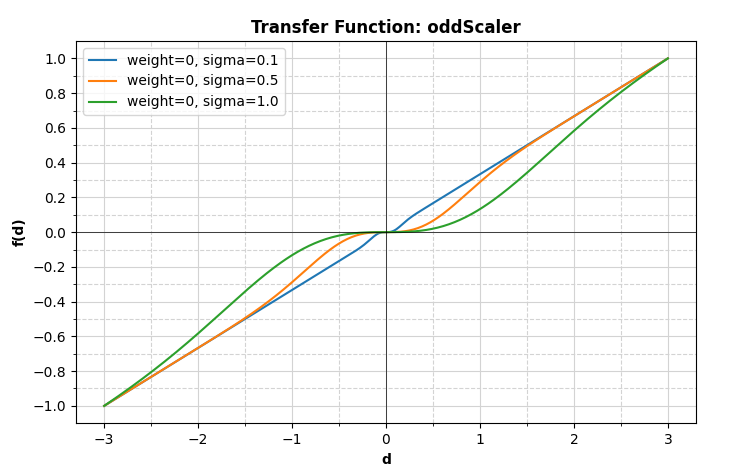
    </td>
  </tr>
  <tr>
    <td align="center" colspan="2">
      <em>Transfer function representation with changing $w$ (left) and $\sigma$ (right)</em>
    </td>
  </tr>
</table>


```math
  f(d) = \overline{d} \cdot \left( 1 - \exp\left( -\frac{\overline{d}^2}{2 \sigma^2} \right) \right)
```


> [!NOTE]
> - As $|d| \to \infty$, the exponential vanishes, and $f(d) \sim c \cdot d$
> - $\lim_{x \to a} f(x) = x^3$ - function behaves cubically near 0 (useful for smoothly marking the interface region)
> - $\sigma \in (0.0, 1.0]$ controls the width of the transition region leading to steep decrease of $f(d)$ near $d^{max}$ for increasing $\sigma$ values
> - $\overline{d} = d + w \cdot d^{max}$, with $w \geq 0$ - shifts the function to the left including in the refinement region also cells with small negative $d$ values
> - output function normalised by its maximum value

<p align="center">
    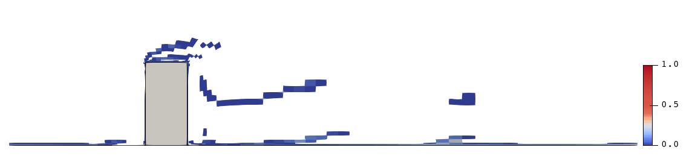
    <br>
    <em>Example with $\sigma \eq 1$ and $w \eq 0$</em>
</p>
<p align="center">
    
    <br>
    <em>Example with $\sigma \eq 1$ and $w \eq 0.3$</em>
</p>
<p align="center">
    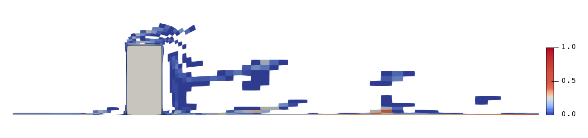
    <br>
    <em>Example with $\sigma \eq 1$ and $w \eq 0.5$</em>
</p>
<p align="center">
    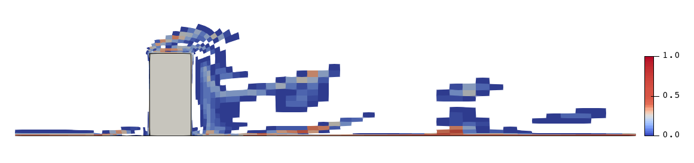
    <br>
    <em>Example with $\sigma \eq 1$ and $w \eq 1$</em>
</p>

###### c) **markCoreSafeScaler**:

Based on the previously described odd transfer function (i.e. *oddScaler*) but with a safe control of the maximum value of the input field.

This transfer function is designed to decrease the relevance of cells with large positive $d$ values. The reason is that, AMR might lead to numerical issues that propagates fast into the domain leading to an abrupt increase of cells with large positive $d$ values (not representative of the actual flow features). This transfer function is designed to mitigate this issue by applying a damping mechanism controlled by the parameter $\alpha$, which have a dual effect:
 - decreasing alpha shift the maximum value of the function to the left, towards $\overline{d} = 0$ (i.e., towards $d = -w \cdot d^{max}$);
 - decrease the function value at $d = d^{max}$

<table align="center">
  <tr>
    <td align="center">
      
    </td>
    <td align="center">
      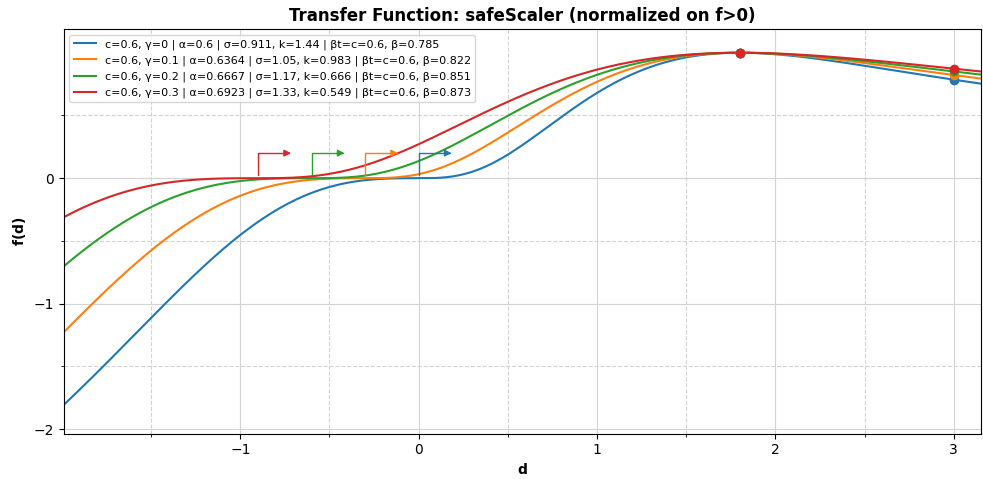
    </td>
  </tr>
  <tr>
    <td align="center" colspan="2">
      <em>Transfer function representation with changing $w$ (left) and $\sigma$ (right)</em>
    </td>
  </tr>
</table>

```math
    f^{oddScaler}(d) = \overline{d} \cdot \left( 1 - \exp\left( -\frac{\overline{d}^2}{2 \sigma^2} \right) \right)
    f^{safe}(d) =   \left\{
    \begin{array}{ll}
        1 & \overline{d} \leq 0 \\
        \frac{1}{1 + \kappa^\ast \cdot \overline{d}^2} & \overline(d) > 0
    \end{array}
    \right.
    f(d) =  \left\{
    \begin{array}{ll}
        f^{oddScaler}(d) \cdot f^{safe}(d) & w != 1 \\
        f^{oddScaler}(d) & w = 1
    \end{array}
    \right.
```

> [!NOTE]
> - $\overline{d} = d + w \cdot d^{max}$ same definition as before
> - $\kappa^\ast$ is a calculated coefficient that forces the function to peak at $d = \alpha \cdot d^{max}$
> - $0 < \alpha \leq 1$ user-defined parameter to control function peak position and its ratio to the value at $d = d^{max}$ (default: 0.6)
> - additional damping function for $\overline{d} > 0$ to ensure that: $d^{peak} = \alpha \cdot d^{max}$, where d^{peak} is the value of d for which the function peaks
> - for a given $\alpha$, the values of sigma and $\kappa$ are computed targeting the following condition: $f(d^{max}) = \alpha$ and $f(d^{peak})
> - if $\alpha = 1$, oddScaler is used with user-defined sigma value
> - the output function is normalised by its maximum value
> - *t* defined as normalised coordinate $t = \frac{\overline{d}}{2*\sigma^2}$ and $t^\ast = \frac{\overline{d}_{max}}{2*\sigma^2}$ are used in the derivation of the damping coefficient to satisfy user's constraint $\alpha$

<p align="center">
    
    <br>
    <em>`oddScaler` function with $\sigma \eq 1$ and $w \eq 0.5$</em>
</p>
<p align="center">
    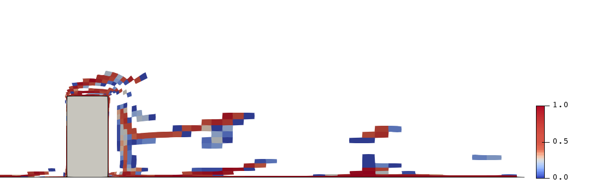
    <br>
    <em>`safeScaler` with $\sigma \eq 1$, $w \eq 0.5$, and $\alpha = 0.5$</em>
</p>

> [!IMPORTANT]
> The implementation is split into three parts: (a) utilities, (b) coefficients caching, and (c) field operation loop.
> (a) utilities:
> - `qOf(t)` calculates auxiliary variable used in the derivation of the damping coefficients, including safety check for small t using Taylor expansion.
> - `gOf(t)` is the objective function for the root-finding algorithm, designed to find seek *t* such that $g(t) = 0$. Where $/beta(t)$ represents the effective damping ratio at a specific normalised coordinate *t*.
> - `solveTStar` finds the root $t^\ast$ of $g(t) = 0$ in two steps: (1) grid search scanning a logarithmic range of t to find a bracket where the function changes sign, and (2) bisection method to refine the root within the identified bracket.
> - `calcKhat(tStar)` once $t^\ast$ is found, this function computes the corresponding damping coefficient $\hat{\kappa}$ using
> (b) coefficients caching (`getOptimizationCoeffs`):
> calculating $t^\ast$ involves iterative root-finding which can be computationally expensive. To mitigate this, the implementation includes a caching mechanism that stores previously calculated $t^\ast$ values for given $\alpha$ and $w$ parameters, to recover values if parameters do not change between iterations.
 > - static `HashTable<optimizationCoeffs, word> cache` stores the results
 > - unique string key generated from $\alpha$ and $w$ parameters to identify cached results
 > - the logic follows a check if the key exists in the cache, if yes, it returns the cached value of `tStar` and `Khat`, if not, it calls `solveTStar` and `calcKhat` storing the results in the cache before returning them.
 > (c) field operation loop:
 > - input validation because we want control alpha dynamically during the simulation
 > - fallback to oddScaler if alpha is equal to 1 (i.e., no damping)
 > - retrieve coefficient from cache or calculate it if not available
 > - apply the transfer function to the field in a loop over all cells based on the effective Gaussian width (`sigmaStar`) and the damping coefficient (`kStar`)

<p align="center">
    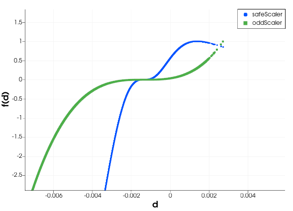
    <br>
    <em> Applied `oddScaler` vs `safeScaler` with $\sigma \eq 1$ and $w \eq 0.5$</em>
</p>

 > [!WARNING]
 > - not addressed crash testing with $w > 2$

###### d) **markCoreGaussSink**:

Gaussian-like function peaking where nLvk = Lvk / c2 = 1, and decays for
increasing values of nLvk:

<table align="center">
  <tr>
    <td align="center">
      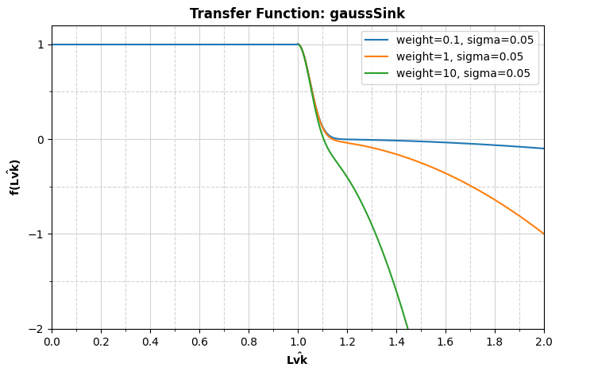
    </td>
    <td align="center">
      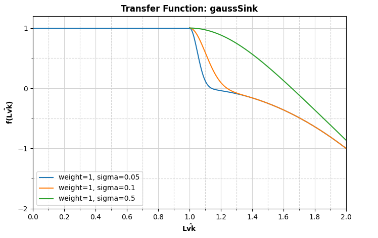
    </td>
  </tr>
  <tr>
    <td align="center" colspan="2">
      <em>Transfer function representation with changing $w$ (left) and $\sigma$ (right)</em>
    </td>
  </tr>
</table>

```math
    f(nLvk) = \exp\left( -\frac{1}{2} \left( \frac{nLvk - 1}{\sigma} \right)^2 \right) + w \cdot (nLvk - 1)^2
```


<p align="center">
    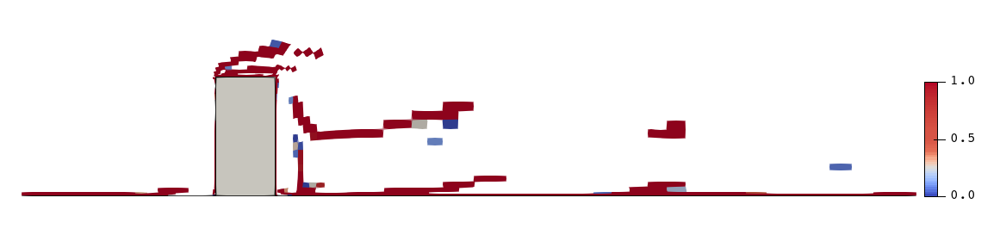
    <br>
    <em>Example with $\sigma \eq 0.05$ and $w \eq 1$</em>
</p>
<p align="center">
    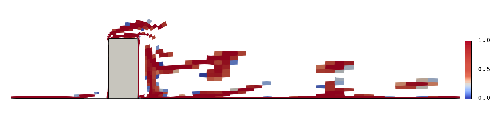
    <br>
    <em>Example with $\sigma \eq 0.5$ and $w \eq 1$</em>
</p>
<p align="center">
    
    <br>
    <em>Example with $\sigma \eq 0.05$ and $w \eq 1$</em>
</p>

<p align="center">
    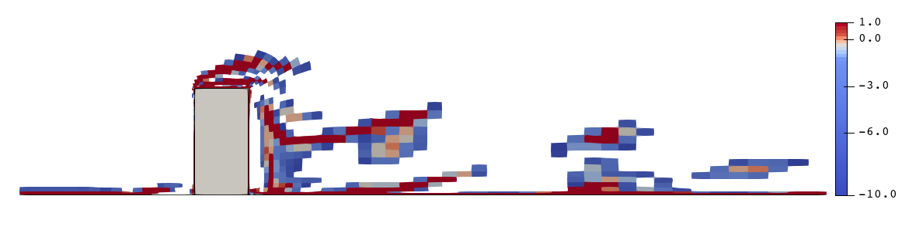
    <br>
    <em>Example with $\sigma \eq 0.05$ and $w \eq 10$</em>
</p>


> [!NOTE]
> - $w \geq 0$
> - $w$ controls values outside the focus region
> - by construction, $L_{vk} = max(c_1, c_2)$ therefore all cells where $c_1 \leq c_2$ (i.e., $d \geq 0$) are going to have $nLvk eq 1$

##### 2. **focusRegion = "periphery"**

Focuses refinement in the periphery of vortex structures rather than
their core.

Available transfer functions:

###### e) **markPeripheryGaussSink**:

Gaussian-like function peaking at a user-defined reference value
of Lvk (e.g., a free-stream value). Same as 'c' but different nLvk
definition:


```math
    f(nLvk) = w_1 \cdot \exp\left( -\frac{1}{2} \left( \frac{nLvk - 1}{\sigma} \right)^2 \right) - w_2 \cdot (nLvk - 1)^2
```

